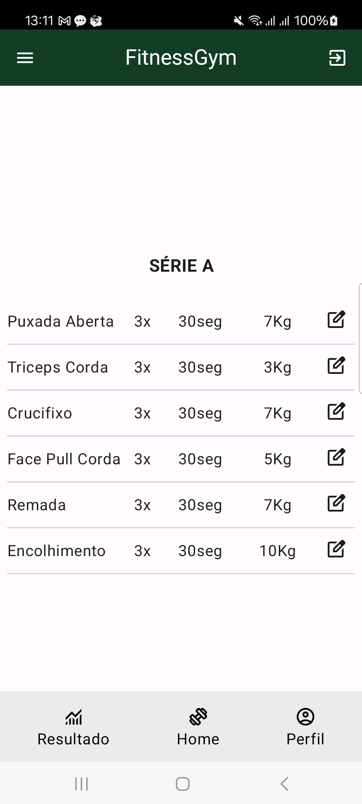
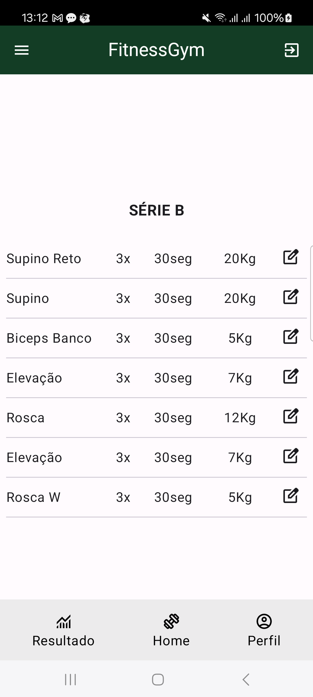

# FitnessGym-KMP
### [Kotlin](https://kotlinlang.org/docs/multiplatform.html) - Kotlin Multiplatform

Project FitnessGym using kotlin multiplatform for Swift and Kotlin.

## Screenshot

  
  

## Dependencies

- [Ktor](https://ktor.io)
- [coroutines](https://kotlinlang.org/docs/coroutines-overview.html)
- [View Model](https://developer.android.com/topic/libraries/architecture/viewmodel)

